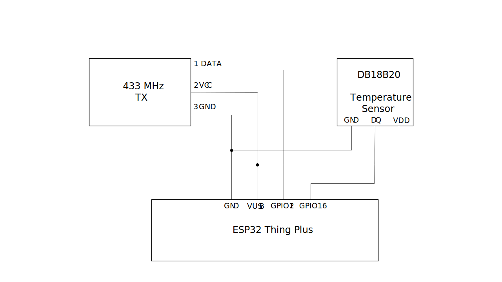
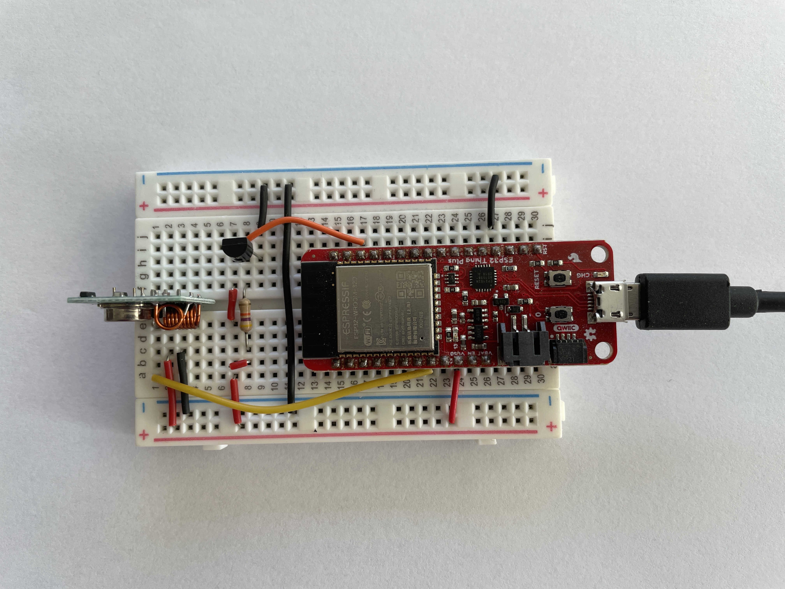
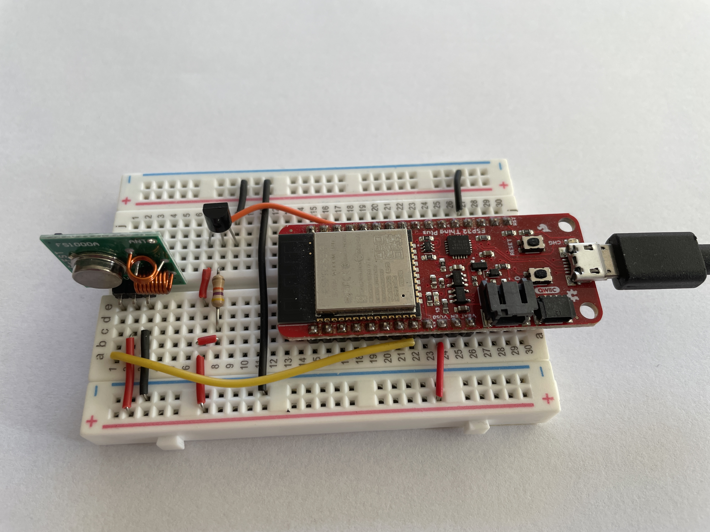

# RedSprite Energy Project - Investigating Cheap Temperature Sensing - Transmitter

This repository forms one of a series related to the RedSprite Energy Project. In particular this repository
provides an Arduino project for a Sparkfun ESP32 Thing Plus (WRL-15663) which acts as a test for the DB18B20
temperature sensor and a 433MHz transmitter. This repo should be used in conjunction with
[mdrfrx](https://bitbucket.org/terzodigital/mdrfrx/src/master/) which acts as a receiver and tests other sensors.

## Overview

This repository provides a simple Arduino project which reads a temperature value from a temperature sensor and
sends that value over a 433MHz RF transmitter.

The figure above is the circuit diagram for this project.

The photos above show different views of the same built versions of the previous circuit diagram.

## Parts

This section lists the parts and then provides more detailed information for each of the parts in further subsections
where appropriate.

| Description | Part | Part Number | Quantity |
| ------------|------|-------------|----------|
| Processor | Sparkfun ESP32 Thing Plus | WRL-15663 | 1 |
| Temperature Sensor | - | DB18B20 | 1 |
| RF Transmitter | 433 MHz Transmitter | - | 1 |
| Prototyping Breadboard | Breadboard | - | 1 |
| Wiring | Wires | - | As required |

### Sparkfun ESP32 Thing Plus

* [Hookup Guide](https://learn.sparkfun.com/tutorials/esp32-thing-plus-hookup-guide/all) - Use this to get going with the ESP32 Thing Plus

### 433 MHz RF Transmitter

* [433 MHz RF TX and RX Modules Arduino Tutorial using Radiohead](https://lastminuteengineers.com/433mhz-rf-wireless-arduino-tutorial/)
* [RadioHead library](http://airspayce.com/mikem/arduino/RadioHead/)
* [A second tutorial on using 433 MHz modules with Arduino and Radiohead](https://randomnerdtutorials.com/rf-433mhz-transmitter-receiver-module-with-arduino/)

### DB18B20 Temperature Sensor

* [Datasheet](https://www.analog.com/media/en/technical-documentation/data-sheets/ds18b20.pdf)
* [Arduino tutorial](https://lastminuteengineers.com/ds18b20-arduino-tutorial/)

## Building and Testing

You can follow the steps below to get the Arduino set up and working for this project:

1. Install Arduino
1. Add ESP32 board information source to the preferences. Go to File | Preferences and in Additional Board Manager URLs add the following: https://raw.githubusercontent.com/espressif/arduino-esp32/gh-pages/package_esp32_index.json
1. May need to add the AVR Arduino Boards to Arduino
1. If necessary add the CP102 serial drivers to support the board on Windows
1. Install the DS18B20 library and its requirement (OneWire)
1. Install the RadioHead library from [Airspayce](https://airspayce.com) as a ZIP library using Sketch | Include Library | Add ZIP Library.

---
